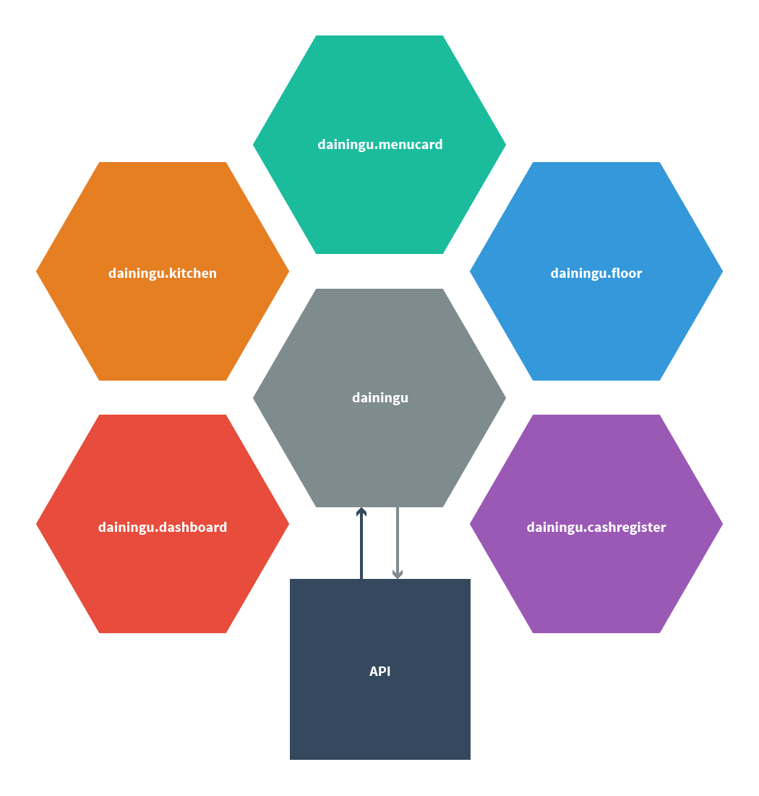
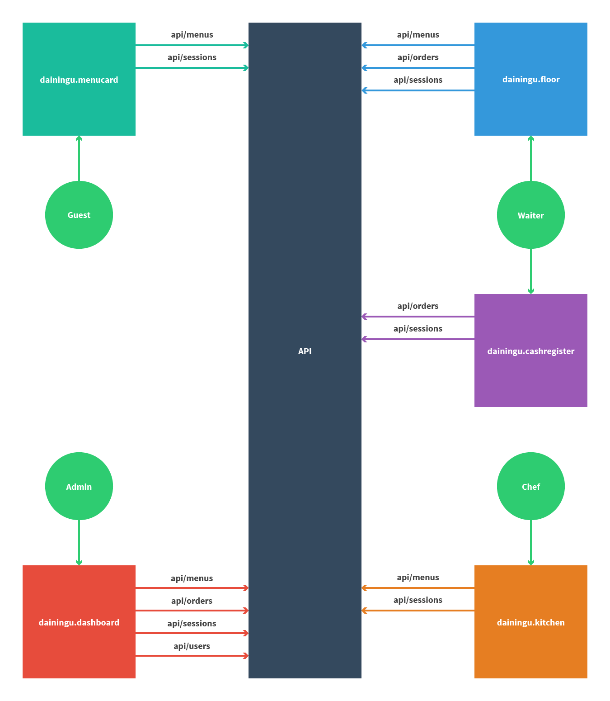

# dainingu

> Unfinished digital menu card system.

## Structure
    client/
        build/ (created on the fly)
        dist/ (created on the fly)
        src/
    gulpfile.js
    karma.conf.js
    server/


## Overview of AngularJS modules
    dainingu --> [
        dainingu.core --> [
            ngAnimate,
            ngResource,
            ui.router
        ],

        dainingu.home,

        dainingu.cashregister,
        dainingu.dashboard,
        dainingu.floor,
        dainingu.kitchen,
        dainingu.menucard,

        dainingu.templates,
        dainingu.widgets
    ]


Overview of REST interactions with backend API
-------------------


Technologies
-------------------
- [AngularJS](http://angularjs.org) (Frontend JS framework)
- ...

Prerequisites
-------------------
Be sure to have the following prerequisites installed.

- [Node.js](http://nodejs.org/) (0.10.x)
- [npm](https://www.npmjs.org/) (1.4.x)
- [gulp](http://gulpjs.com/) (3.8.10)
- ...

Installation
-------------------
Install application using npm.

```
$ npm install
```

Run
-------------------
Run application using gulp.

```
$ gulp
```

To-do
-------------------
- Add server application to the stack.